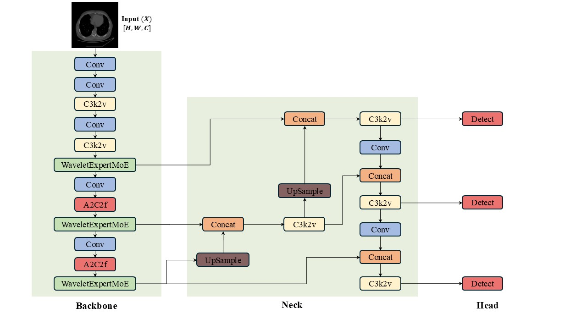
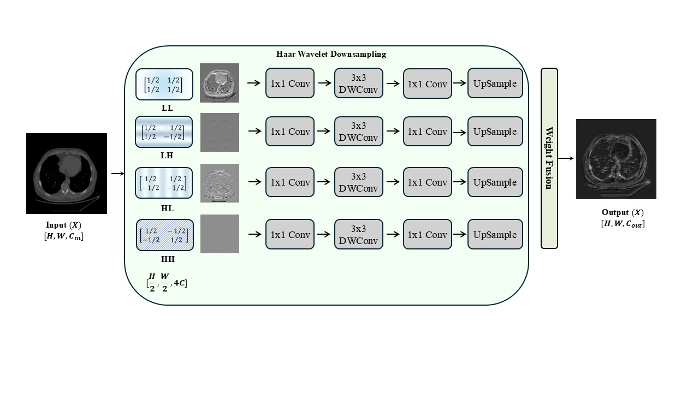
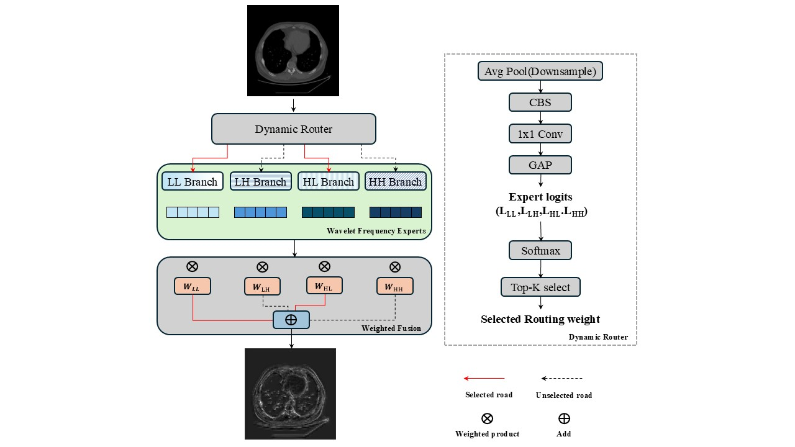
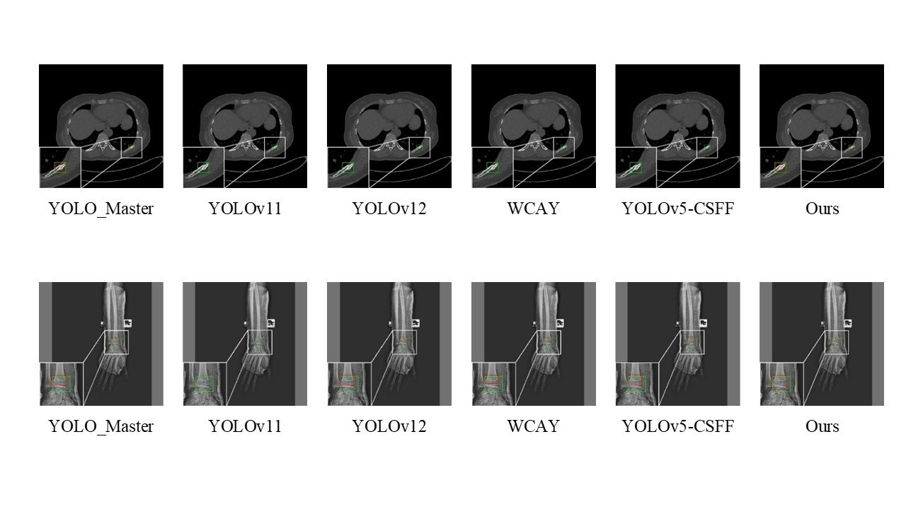
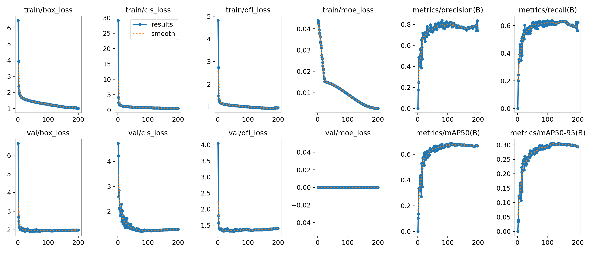

# WDR-MoE

## 用於 AI 輔助醫學影像骨折偵測的頻率感知混合專家模型

[English](README.md)

本 repository 是 **WDR-MoE** 的官方實作。WDR-MoE 是一套用於骨折偵測的 Wavelet-based Dynamic Routing Mixture-of-Experts 框架；模型以 [YOLO-Master](https://github.com/Tencent/YOLO-Master) 為基礎，加入 Wavelet Frequency Expert（WFE）與 Frequency-aware Dynamic Router（FDR），以保留細微骨折特徵，並將輸入動態分配給適合的頻率 expert。

## 主要特色

- **Wavelet Frequency Expert（WFE）：** 將 feature map 分解為 LL、LH、HL、HH 四個 Haar 子頻帶，學習頻率專門化表徵。
- **Frequency-aware Dynamic Router（FDR）：** 使用 global context 與 sparse top-k routing，為每個輸入選擇適合的 expert。
- **跨模態評估：** 同時在 RibFrac CT 切片與多部位 FracAtlas X-ray 上驗證。
- **可重現發布：** 提供模型設定、訓練程式、資料集範本、整理後的指標與論文圖片，不重新散布原始病患資料集。

## 模型架構

<p align="center">
  
</p>

WDR-MoE 在 YOLO-Master backbone 中加入頻率感知的 expert 處理。FDR 預測稀疏 routing weights，固定 Haar 小波的 WFE 分支則保留骨折的低頻與高頻線索，最後進行加權特徵融合。

## 方法

### Wavelet Frequency Expert（WFE）

<p align="center">
  
</p>

WFE 使用不可訓練的 2D Haar discrete wavelet transform，將輸入分解為 LL、LH、HL、HH 四個子頻帶。每個 expert 透過 pointwise 與 depthwise convolution 專門處理一個頻帶，再以 nearest-neighbor upsampling 回復空間尺寸。本次公開版本只保留正式論文實驗所使用的固定小波設計。

### Frequency-aware Dynamic Router（FDR）

<p align="center">
  
</p>

FDR 從 global pooled context 產生 sparse top-k routing probabilities，再依 routing weights 融合被選取的 WFE 輸出，使模型能針對不同影像動態調整頻率響應。

## 目錄結構

```text
.
├── assets/results/              # 整理後的實驗指標與彙總圖
├── configs/                     # 資料集 YAML 範本
├── img/                         # 架構圖與定性比較圖
├── ultralytics/
│   ├── cfg/models/master/       # Baseline 與正式 WDR-MoE 設定
│   └── nn/modules/moe/          # Router、expert、loss 與分析工具
├── tools/                        # 預測結果視覺化工具
├── train.py                     # 可重現的訓練入口
├── val.py                       # 可重現的驗證入口
└── test_wavelet_moe.py          # 固定 Haar WFE smoke test
```

## 安裝

建議使用 Python 3.10 以上版本。先依 CUDA 版本安裝 PyTorch，再安裝本專案：

```bash
git clone https://github.com/Ryan-camak/WDR-MoE.git
cd WDR-MoE
python -m venv .venv
source .venv/bin/activate
python -m pip install --upgrade pip
python -m pip install -e .
```

## 資料集

本 repository 不重新散布資料集。請由官方來源取得資料，並遵守各資料集的授權與存取規範。

- **RibFrac：** 論文依官方切分，將 3D CT 轉成 axial 2D detection images，只保留含骨折的切片；處理後包含 6,761 張訓練影像與 846 張驗證影像。
- **FracAtlas：** 論文採用 6:2:2 的訓練、驗證與測試切分。

複製對應範本並修改其中的 `path`：

```bash
cp configs/ribfrac.example.yaml configs/ribfrac.yaml
# 或
cp configs/fracatlas.example.yaml configs/fracatlas.yaml
```

標註採 YOLO detection 格式：`class x_center y_center width height`，座標正規化至 `[0, 1]`。

## 訓練

以下指令預設使用 WDR-MoE 設定與論文中的主要超參數：200 epochs、640 × 640 輸入、batch size 32、SGD，以及從 0.005 衰減至 0.00005 的 cosine learning-rate schedule。

```bash
python train.py --data configs/ribfrac.yaml --device 0
```

完整範例：

```bash
python train.py \
  --data configs/ribfrac.yaml \
  --model ultralytics/cfg/models/master/v0_1/det/yolo-master-n-fixwavelet.yaml \
  --epochs 200 --batch 32 --imgsz 640 --moe-loss 0.15
```

公開模型完全依照論文：使用固定 2D Haar DWT、每個 expert 對應一個頻帶，並在頻率專門化處理後以 nearest-neighbor upsampling 回復尺寸。

## 驗證與推論

```python
from ultralytics import YOLO

model = YOLO("path/to/best.pt")
metrics = model.val(data="configs/ribfrac.yaml", imgsz=640)
predictions = model.predict(source="path/to/images", imgsz=640, save=True)
```

亦可使用命令列驗證：

```bash
python val.py --model path/to/best.pt --data configs/ribfrac.yaml --device 0
```

小波分析與重建的 smoke test：

```bash
python test_wavelet_moe.py
```

## 實驗結果

### RibFrac

| 方法 | Precision | Recall | mAP50 | F1-score |
|---|---:|---:|---:|---:|
| YOLOv11 | 74.7% | 57.9% | 63.0% | 65.2% |
| YOLOv12 | 76.4% | 59.1% | 64.7% | 66.7% |
| YOLO-Master | 76.9% | 60.6% | 64.6% | 67.8% |
| YOLOv5-CSFF | 71.4% | 55.8% | 59.1% | 62.7% |
| WCAY | 78.2% | 55.2% | 61.5% | 64.7% |
| **WDR-MoE（本方法）** | **80.5%** | **61.7%** | **67.7%** | **69.9%** |

### FracAtlas

| 方法 | Precision | Recall | mAP50 | F1-score |
|---|---:|---:|---:|---:|
| YOLOv11 | 61.4% | 32.2% | 36.8% | 42.2% |
| YOLOv12 | 45.3% | 30.7% | 30.2% | 36.6% |
| YOLO-Master | 43.6% | 35.0% | 36.7% | 38.8% |
| YOLOv5-CSFF | 35.5% | 32.8% | 29.8% | 34.1% |
| WCAY | 48.4% | **39.3%** | 39.5% | 43.4% |
| **WDR-MoE（本方法）** | **62.6%** | 34.4% | **40.9%** | **44.4%** |

### FracAtlas 消融實驗

| FDR | WFE | Precision | Recall | mAP50 | F1-score |
|:---:|:---:|---:|---:|---:|---:|
|  |  | 45.3% | 30.7% | 30.2% | 36.6% |
| ✓ |  | 57.6% | 31.1% | 36.3% | 40.4% |
|  | ✓ | 44.8% | 31.1% | 31.0% | 36.7% |
| ✓ | ✓ | **62.6%** | **34.4%** | **40.9%** | **44.4%** |

### 定性比較

<p align="center">
  
</p>

上排為 RibFrac CT 範例，下排為 FracAtlas X-ray；紅框標示各方法偵測到的骨折區域。

### 公開的訓練產物

<p align="center">
  
</p>

整理後的 CSV 與彙總圖位於 [`assets/results`](assets/results)。模型權重不納入 Git 歷史；如需公開，建議放在 GitHub Releases 或 Zenodo。

## 引用

請引用正式發表的論文。下列題名與作者順序來自提供的 manuscript；repository 公開前，請用出版商資料補上正式 venue 與 DOI。

```bibtex
@inproceedings{jhong2026wdrmoe,
  title     = {{WDR-MoE}: Frequency-Aware Mixture-of-Experts for Fracture Detection in AI-Assisted Medical Imaging},
  author    = {Jhong, Sin-Ye and Lin, Bo-Xian and Li, Shang-Lin and Chen, Yung-Yao and Luo, Huai-An},
  booktitle = {TODO: 正式出版 venue},
  year      = {2026},
  doi       = {TODO: 出版商 DOI}
}
```

使用本實作時，也請依原始 repository 的說明引用 YOLO-Master 與 Ultralytics。

## 授權與致謝

本 fork 延續上游的 [AGPL-3.0 授權](LICENSE)，並以 [Tencent YOLO-Master](https://github.com/Tencent/YOLO-Master) 與 [Ultralytics](https://github.com/ultralytics/ultralytics) 為基礎。WDR-MoE 亦參考論文所列的 Haar wavelet downsampling 與 MoE routing 研究。

本專案為研究用途程式，並非經認證的醫療器材；未經獨立驗證與法規審查，不應用於臨床診斷。
